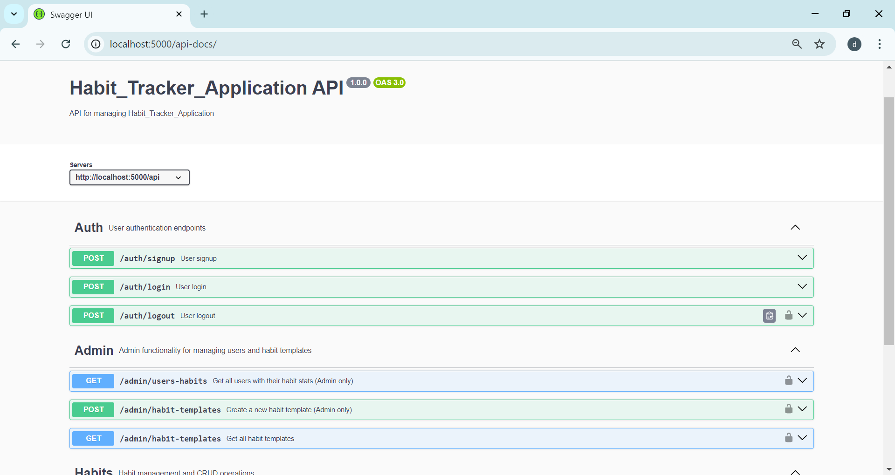
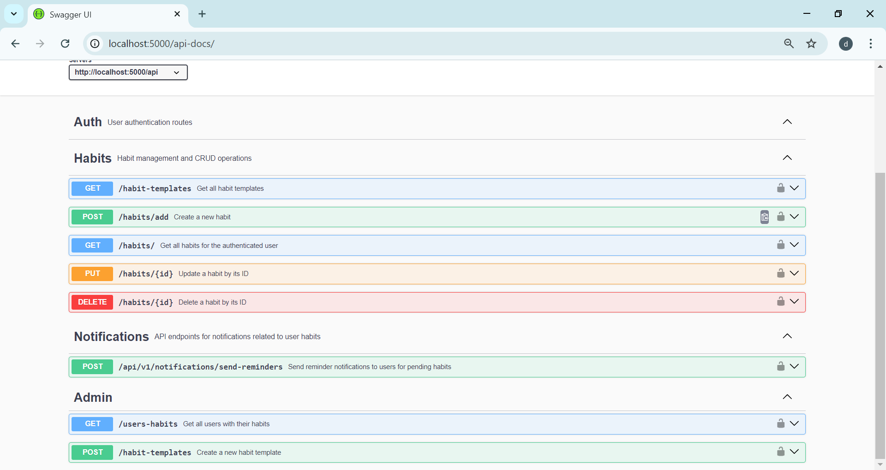

 <h1>Habit Tracker Application</h1>

## Expense Swagger UI


<br>


# Habit Tracker API

## Objective

This project sets up a backend API for user authentication, habit management, and habit tracking using Node.js, Express, and MongoDB. The API supports secure user authentication, CRUD operations for habits, daily reminders via notifications, and admin controls for managing habit templates and viewing user stats.

## Features

- **JWT-Based User Authentication**: Secure login and registration endpoints.
- **Habit Management**: Endpoints to create, read, update, delete user habits. Track streaks, daily progress, and frequency settings.
- **Reminders & Notifications**: Cron job-based daily reminders for users to complete their habits.
- **Admin Controls**: Admins can view all users with habit completion stats and create habit templates that users can adopt.

## Technologies Used

- **Node.js**: JavaScript runtime for backend logic.
- **Express.js**: Web framework for routing and middleware.
- **MongoDB**: NoSQL database for storing user and habit data.
- **Mongoose**: ODM for MongoDB to manage schemas and data models.
- **JWT**: JSON Web Tokens for secure authentication.
- **Node-Cron**: For scheduling daily habit reminder notifications.
- **Nodemailer**: For sending email notifications.
- **Swagger**: API documentation.
- **Postman**: API testing and documentation.

## Prerequisites

- [Node.js] (version 14.x or higher)
- [MongoDB](local or cloud instance)
- [Postman] (for testing API)
- Render (for deployment)

## Installation and Setup

1. Clone the repository:
   ```bash
   git clone https://github.com/Devanshiballar/Habit_Tracker_Application.git
   ```

### Setup .env file

MONGO_URL=Your_mongo_url
PORT=Sevice_port
NODE_ENV=NODE_ENVIRINMENT
JWT_SECRET=jwt_secret
EMAIL_USER = email_user
EMAIL_PASS = email_password

### Run this app locally

shell
npm run build

### Start the app

shell
npm start
